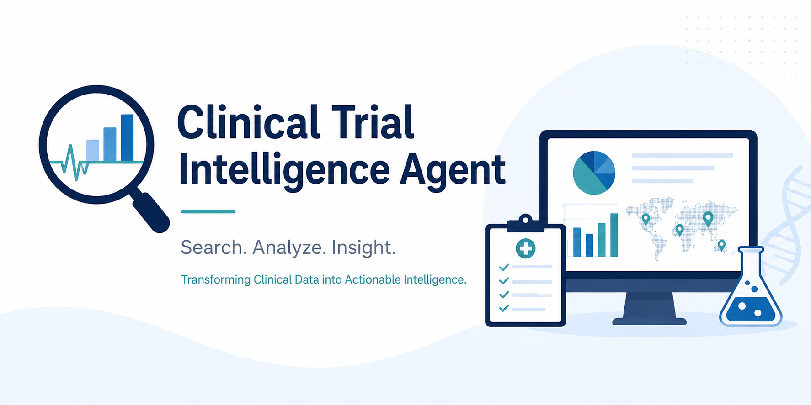
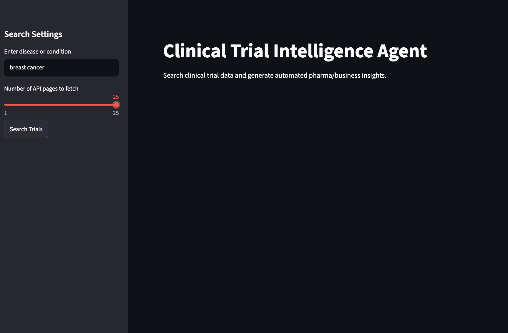
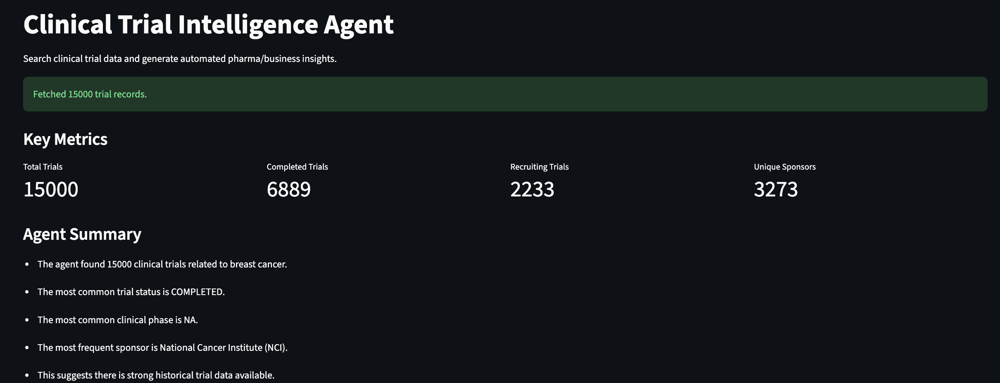
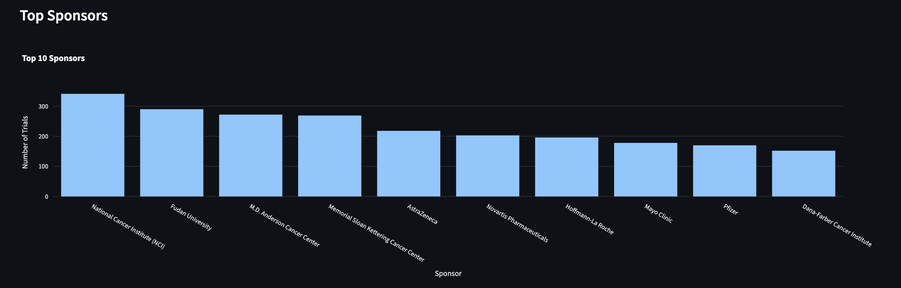
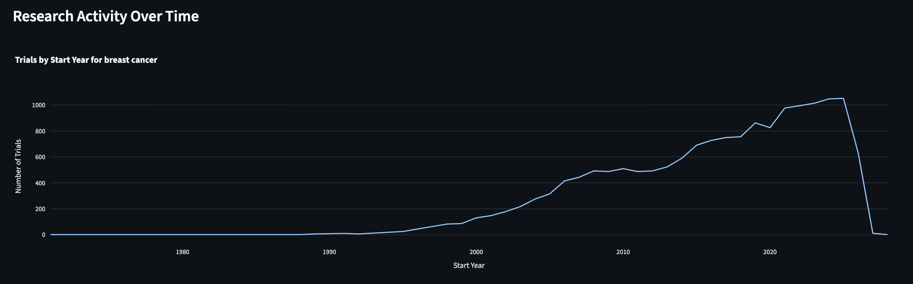
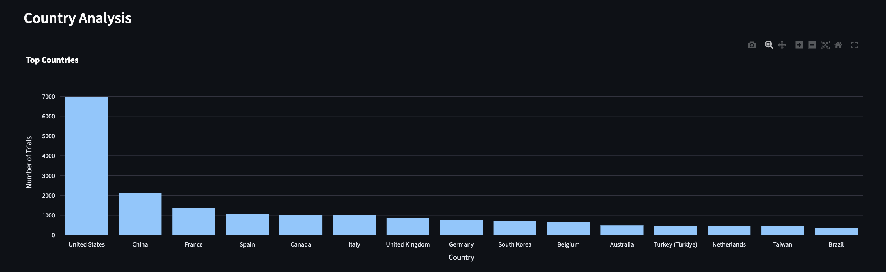

# Clinical Trial Intelligence Agent

A Streamlit-based analytics application that retrieves clinical trial data from ClinicalTrials.gov and automatically generates insights on research activity, sponsors, trial phases, interventions, and geographic distribution.
---
## Features

### Clinical Trial Search

Search clinical trials by disease or condition using the ClinicalTrials.gov API.

Examples:

- Breast Cancer
- Diabetes
- Multiple Sclerosis
- Alzheimer's Disease

---

### Automated Agent Insights

The application automatically analyzes retrieved trials and generates observations such as:

- Total number of trials
- Most common trial status
- Most common clinical phase
- Leading sponsors
- Research activity trends

---

### KPI Dashboard

Key metrics include:

- Total Trials
- Completed Trials
- Recruiting Trials
- Unique Sponsors

---

### Sponsor Analysis

Identify the organizations most active in a therapeutic area.

Examples:

- Pharmaceutical companies
- Academic institutions
- Research hospitals

---

### Trial Status Analysis

Visualize the distribution of:

- Recruiting
- Completed
- Active, Not Recruiting
- Not Yet Recruiting
- Withdrawn

---

### Clinical Phase Analysis

Analyze the prevalence of:

- Phase 1
- Phase 2
- Phase 3
- Phase 4

---

### Country Analysis

Identify countries with the highest concentration of clinical trial activity.

---

### Intervention Analysis

Explore the most common interventions being investigated.

Examples:

- Drugs
- Biologicals
- Devices
- Behavioral interventions

---

### Research Activity Over Time

Track how clinical trial activity has evolved over the years for a specific condition.

---

### Data Export

Export retrieved and processed clinical trial data as CSV.

---

## Screenshots

### Main Dashboard



---

### KPI Overview



---

### Sponsor Analysis



---

### Research Activity Over Time



---

### Country Analysis



---

## Technology Stack

### Programming

- Python

### Data Analysis

- Pandas

### Visualization

- Plotly Express

### Web Application

- Streamlit

### Data Source

- ClinicalTrials.gov API

### Version Control

- Git
- GitHub

---

## Project Structure

```text
clinical-trial-agent/
│
├── app.py
├── requirements.txt
├── README.md
│
└── images/
    ├── dashboard.png
    ├── kpi_overview.png
    ├── sponsor_analysis.png
    ├── research_activity.png
    └── country_analysis.png
```

---

## Skills Demonstrated

- API Integration
- Data Visualization
- Dashboard Development
- Business Intelligence
- Healthcare Analytics
- Python Programming
- Streamlit Development
- Git Version Control

---

# 👤 Author

**Arefeh Kardani, PhD**

Background in **Pharmaceutical Biology** transitioning into **Data
Analytics**.


* **LinkedIn:** [Arefeh Kardani](https://www.linkedin.com/in/arefeh-kardani) 